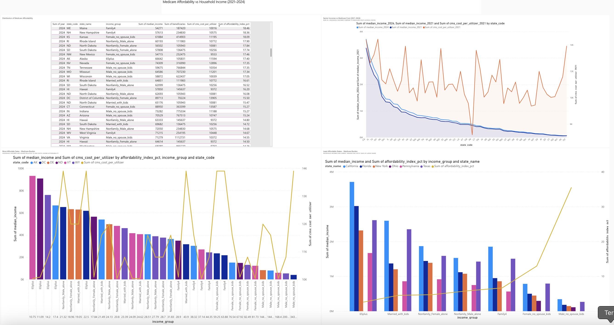
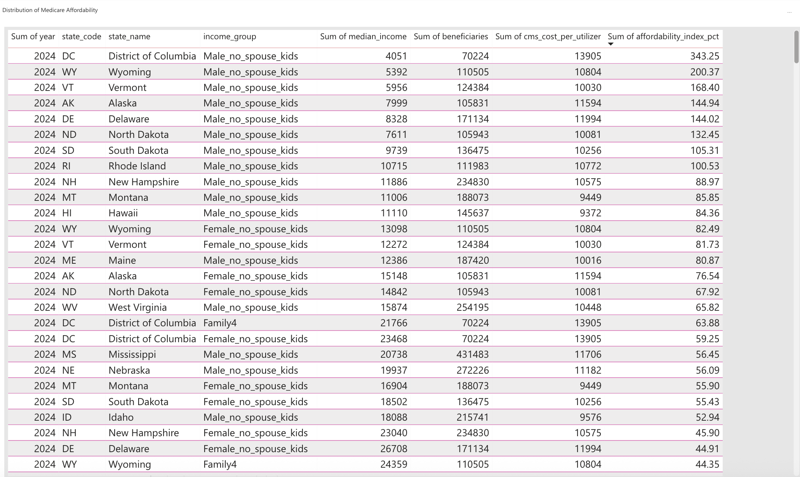
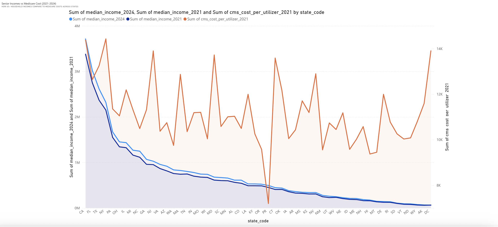
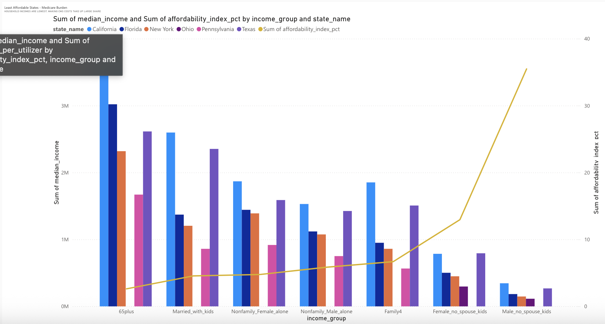
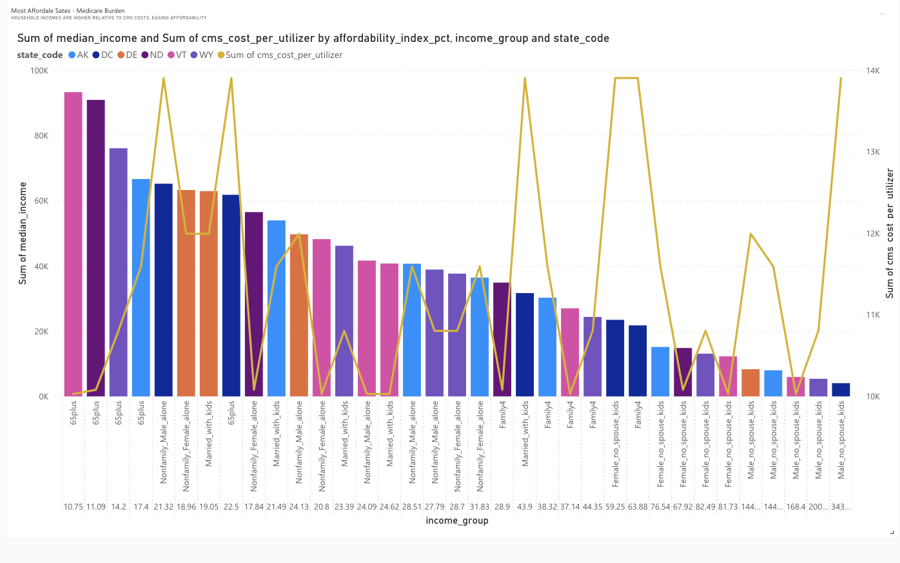

# Medicare Affordability vs Household Income (2021–2024)

**SQL | Python | Power BI**

This project analyzes how Medicare costs compare to household incomes across U.S. states, using **CMS Medicare data (2021)** and **U.S. Census ACS data (2021 & 2024)**.  
The goal was to measure **affordability** for different household groups (seniors, single parents, families of four, etc.) and visualize disparities across states.

---

## Key Findings
- Income vs. Healthcare Costs: States like DC and Connecticut showed ~15% income growth for seniors since 2021, making Medicare relatively more affordable compared to national
  averages.
- Low Income Growth States: States such as Wisconsin and New Mexico only saw ~2% income growth, meaning healthcare takes up a larger share of household budgets.
- Top 5 Most Affordable States: DC, Connecticut, Massachusetts, Maryland, and New Jersey stood out as the most affordable, where income growth significantly outpaced healthcare
  cost growth.
- Bottom 5 Least Affordable States: Wisconsin, New Mexico, Mississippi, Arkansas, and West Virginia emerged as the least affordable, with stagnant or minimal income growth
  widening the cost burden on households.
- Population Segment Impact: Seniors (65+) and single-parent households were the most vulnerable groups, where slow income growth made costs harder to manage.
- Trend Insight: Strong income growth widens the affordability gap positively (income outpaces costs), while slow growth tightens the gap (cost burden rises).
---

## Tech Stack
- **SQL**: Designed schema, loaded CMS & Census datasets, built affordability index queries.  
- **Python (pandas)**: Cleaned raw CSV files, reshaped ACS data into SQL-ready long format.  
- **MySQL**: Created tables and joins for Medicare costs vs. income groups.  
- **Power BI**: Developed interactive dashboards (line charts, bar charts, maps) to compare affordability across states and demographics.  

---

## Why This Project Matters

Healthcare affordability is one of the most pressing policy challenges.
This project demonstrates how data engineering + analytics + visualization can highlight income gaps, cost burdens, and policy tradeoffs.

---

## Dashboards
Screenshots and interactive analysis:  

Dashboard: 

1. **Distribution of Affordability (Table)** – Household income groups vs CMS cost share.
  
  
2. **Seniors Income vs Medicare Costs (Line Chart)** – 2021 vs 2024 trend by state.
  
   
3. **Least Affordable States** – Bar + line chart of households facing the heaviest burden.
  
     
4. **Most Affordable States** – Bar + line chart of households with lowest burden.
   

---

##  Project Files
- `schema.sql` – Database schema design.  
- `schema.py` – Python cleaning + CSV transformer for SQL inserts.  
- `analysis.sql` – SQL queries for affordability metrics.  
- `final.py` – Exports query results to CSV for Power BI.  
- `power-bi-exports/` – CSV files imported into Power BI.  
- `dashboards/` – Screenshots of Power BI dashboards.  

